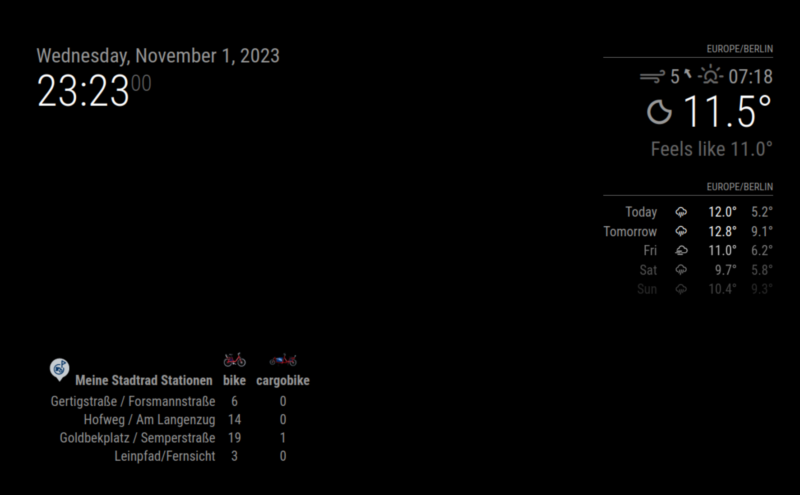
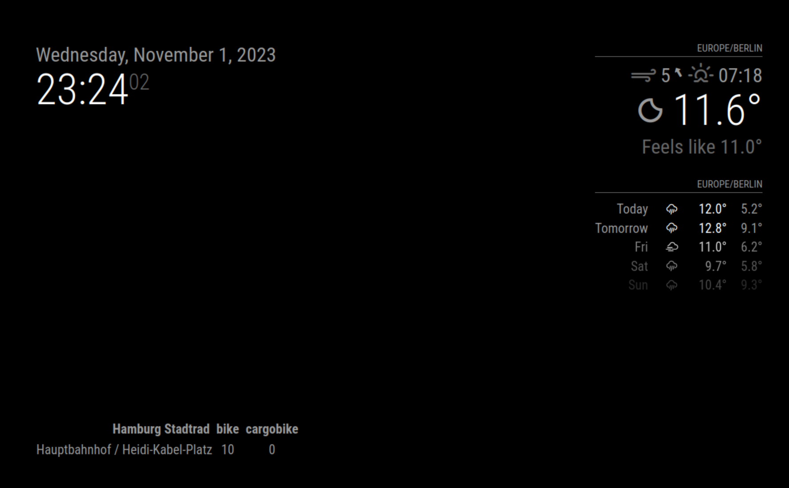

# MagicMirrorModule-HHStadtrad

[MagicMirror Project on GitHub](https://github.com/MichMich/MagicMirror) | [stadtrad.hamburg.de](https://stadtrad.hamburg.de/de/start)

A simple module for the Magic Mirror, which lists the amount of bikes per station.



or plain:



## Usage

To use this module, go to the *modules* subfolder of your mirror and clone this repository.
Go into `MMM-HHStadtrad` folder
Run `npm install`

### Configuration

To run the module, you need to add the following data to your config.js file.

```
{
    module: "MMM-HHStadtrad",
    position: "left_bottom",
    config: {
    }
}
```
### Options

You may want to set the following options in the config section as well:

| Option           | Description                    | Default value                        |
|------------------|--------------------------------|--------------------------------------|
| `title`          | Title of the table             | `Hamburg Stadtrad`                   |
| `srName`         | List of station names          | [`Hauptbahnhof / Heidi-Kabel-Platz`] |
| `srCargopedelec` | Display cargo bikes as well    | `true`                               |
| `srShowImage`    | Display images in table header | `false`                              |


### Help Ukraine

Help Ukrainian effort by donating to [comebackalive.in.ua](https://www.comebackalive.in.ua/donate)


